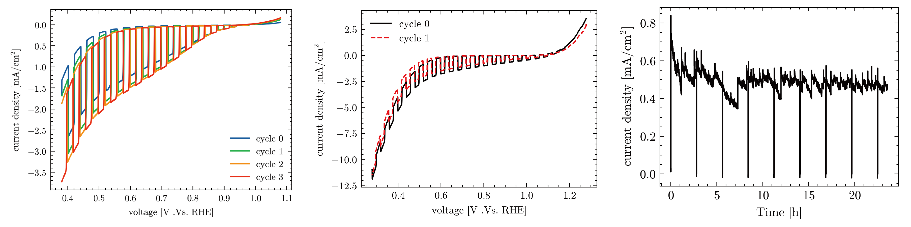
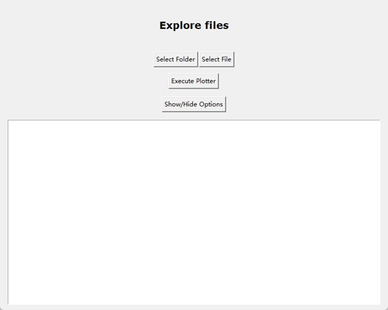
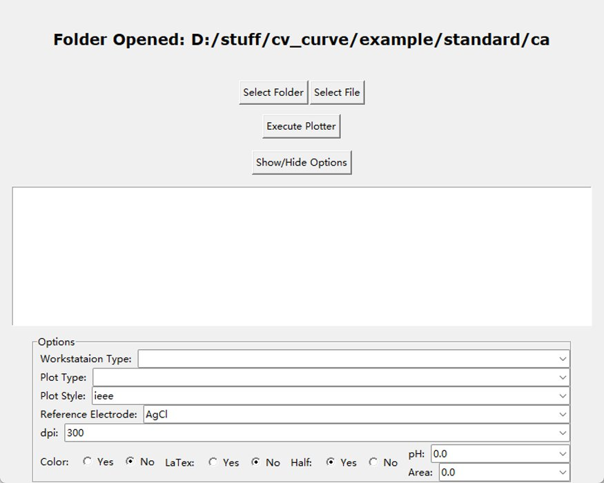
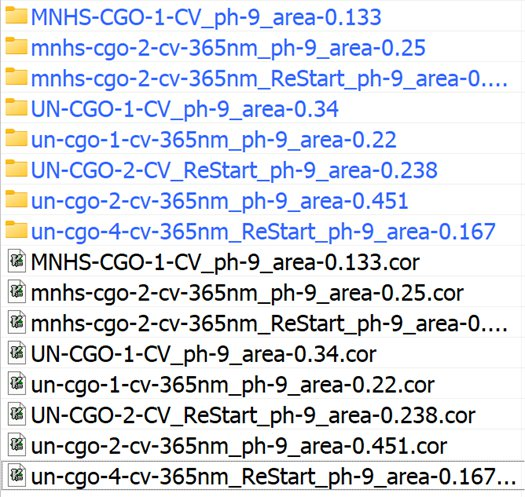

# plot_cv_ca
A gui to plot CV and CA curve

## 软件介绍
- 软件名: `plotter_gui`
- 功能: 对晨华(`ch`)和科斯特(`kst`)电化学工作站的`CV`和`CA`数据进行处理并绘制图形
- 在使用过程中, 绘制的CV曲线不能符合实际的使用要求(不同的数据绘制到一张图), 实用的功能只有数据分割和数据归一化, 将归一化的数据再次用Origin进行处理. 但是对于CA曲线的处理能力(几百万行的数据随便处理)超过了Origin.

## 软件示例

## 软件安装
- Windows安装包或MAC的Windows虚拟机: 直接运行`msi`安装包即可进行安装.
- 从源码安装(跨平台使用, 未经过测试):
  1. 将`src`中的全部文件和文件夹保存到本地目录中
  2. 从python官网下载并安装``python``
  3. 成功安装后, 会添加`pip`命令(`python`的包管理器), 在终端中运行`pip install -r requirements.txt`, 即可安装依赖的包
  4. 执行`python setup.py build`, 会生成`build`文件夹, 编译好的可执行文件可以在这里找到
  5. 苹果电脑也可以编译安装包, 编译好后可以放进来

## 软件使用
### 1. 文件命名
命名文件时在文件的末尾添加上ph值和面积, 如(`75_5_TI_7UM_0.148CA_ph-9_area-0.156.txt`, `un-cgo-4-cv-365nm_ReStart_ph-9_area-0.167.cor`). 这样命名的文件可以自动读取ph值和面积.

### 2. 数据管理
  - 同一类型的数据(同一数据类型, 同一电化学工作站类型)放在一个文件夹下
  - 晨华电化学工作站的数据要保存为txt格式

### 3. 软件使用
- 选择数据: 点击`Select Folder`或`Select File`可以选择文件夹或者文件, 选择文件夹会将文件夹中所有的数据进行处理, 选择文件则处理一个  

- 设置选项: 点击`Show/Hide Options`可以打开选项, 可以选择电化学工作站类型`Workstation Type`, 支持科斯特`kst`和晨华`ch`, 可以选择数据处理类型`Plot Type`, 支持`cv`和`ca`曲线, 和一些其他设置  

- 执行: 选择好要处理的数据和数据处理的类型后点击`Execute Plotter`即可开始执行数据处理, 处理好的数据如下, 在当前文件夹下会生成处理好的名字与数据的名字相同的文件夹, 文件夹中有分割好的原始数据`raw_data`, 处理过的数据`normalized_data`和绘制好的图片`pic`   

## 已知的问题
1. 程序执行过程中如果报错gui界面不会有提示或者停止, 如果在点击Execute Plotter之后的很长时间里没有反应, 则是程序出现了问题, 重新启动可能解决.
2. 在测试CV数据时, 会有同学测试一圈半的数据, 该程序目前会把多出来的半圈再去掉一半(已解决)

## 更新计划
- 更加灵活的ph和面积的识别
- 增加对一圈半等数据的识别(已解决)
- 添加将不同CV曲线绘制到一个图片的功能(类似于data1[1], data2[3], data3[1], 并且可以重命名label)
- 美化gui
- 对于超多数据添加并行处理的功能